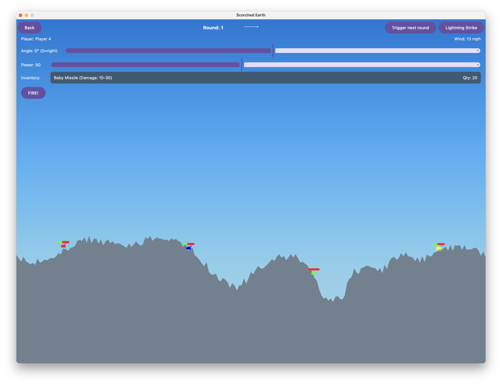

# Scorched Earth - Compose Multiplatform Edition

A modern remake of the classic DOS game *Scorched Earth* implemented using Kotlin Multiplatform and Compose for Desktop.

Check out the [demo video](docs/movie.mov) to see the game in action!

## About the Game

Scorched Earth is a turn-based artillery game where players command tanks positioned on a destructible terrain. Players take turns adjusting their cannon's angle and power to fire projectiles at opponents, with the goal of destroying all enemy tanks.

## Features

- **Procedurally Generated Terrain**: Each game features unique, destructible terrain that changes as projectiles impact the surface
- **Weather Effects**: Dynamic weather system including rain and lightning that affects gameplay
- **Multiple Terrain Styles**: Choose from different terrain generation algorithms
- **Player vs Player**: Local multiplayer support
- **Projectile Physics**: Realistic projectile motion affected by gravity and wind
- **Inventory System**: Collect and use different projectiles and shields
- **Turn-Based Gameplay**: Strategic gameplay where timing and precision are key

## Controls

- **Angle Control**: Adjust the angle of your cannon
- **Power Control**: Set the power of your shot
- **Inventory Selection**: Choose between different projectiles and shields
- **Fire Button**: Launch your attack

## Technical Implementation

This project is built using:

- **Kotlin Multiplatform**: For cross-platform code sharing
- **Compose Multiplatform**: For UI rendering across desktop platforms
- **Coroutines**: For managing game state and animations

The game architecture includes:

- **ScorchedEarthGame**: Main game engine handling game state and logic
- **TerrainManager**: Generates and manages destructible terrain
- **WeatherManager**: Controls weather effects like rain and lightning
- **PlayerManager**: Manages player states, turns, and interactions
- **ProjectileManager**: Handles projectile physics and collisions
- **ExplosionManager**: Creates and manages explosion effects

## Running the Game

1. Clone the repository
2. Open the project in IntelliJ IDEA or Android Studio
3. Run the desktop application configuration

## Platform Support

Currently supports:
- Windows
- macOS
- Linux

## Future Plans

- Additional weapons and power-ups
- AI opponents with adjustable difficulty
- Networked multiplayer
- Sound effects and music
- Save/load game functionality

## Learn More

- [Kotlin Multiplatform](https://www.jetbrains.com/help/kotlin-multiplatform-dev/get-started.html)
- [Compose Multiplatform](https://www.jetbrains.com/lp/compose-multiplatform/)
